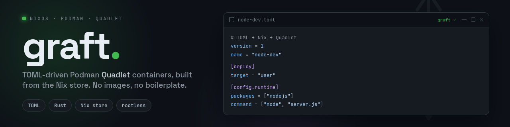

<div align="center">



<br><br>

<p>
  <a href="https://github.com/Patrick-Kappen/graft/actions/workflows/ci.yml"></a>
  <a href="https://github.com/Patrick-Kappen/graft/actions/workflows/pages.yml"></a>
  
  
  
  
  <a href="LICENSE"></a>
  
</p>

<p>
  <a href="docs/overview.md">Overview</a> ·
  <a href="docs/design.md">Design</a> ·
  <a href="docs/quadlet.md">Quadlet</a> ·
  <a href="docs/roadmap.md">Roadmap</a> ·
  <a href="docs/non-goals.md">Non-goals</a> ·
  <a href="docs/reference.md">Reference</a> ·
  <a href="docs/development.md">Development</a> ·
  <a href="examples/reference.toml">Annotated TOML</a>
</p>

</div>

TOML-driven Podman Quadlet containers, built from the Nix store.

Graft turns small TOML files into rootfs-based Podman Quadlet services for
NixOS and Home Manager. You describe container intent; Graft resolves the
runtime details; Nix materialises the rootfs and Quadlet output.

No container images. No ad-hoc package installs. No hand-written Quadlet
boilerplate.

> Status: early MVP. The current `rootfs-store` flow works for NixOS system
> containers and Home Manager user containers, with useful Quadlet rendering for
> common container fields. The broader roadmap is still evolving; see
> [Roadmap](docs/roadmap.md) and [Non-goals](docs/non-goals.md).

## A tiny container

```toml
version = 1
name = "node-dev"

[config.runtime]
packages = ["nodejs"]
```

With no command set, Graft adds a tiny keep-alive process:

```ini
[Container]
ContainerName=node-dev
Rootfs=/nix/store/...-graft-node-dev-env:O
Exec="/bin/graft-pause"
Volume=/nix/store:/nix/store:ro
```

Start it like any other Quadlet-generated service:

```bash
sudo systemctl start node-dev.service
```

For a user/rootless container:

```toml
version = 1
name = "node-dev"

[deploy]
target = "user"

[config.runtime]
packages = ["nodejs"]
```

```bash
systemctl --user start node-dev.service
```

## Why Graft?

- **TOML is user intent** not Nix boilerplate, not Quadlet boilerplate.
- **Packages come from Nix** declare package names in TOML and rebuild.
- **No image pull/build step** containers use `Rootfs=` from the Nix store.
- **NixOS and Home Manager** system/rootful and user/rootless containers.
- **Everything is a service** output is Quadlet `.container` files for systemd.
- **Minimal defaults** no default `bash`, `coreutils`, restart policy, or autostart.

## How it works

```text
TOML
  ↓
graft CLI
  ↓ JSON stdout
Nix IFD
  ↓
rootfs in /nix/store
  ↓
Quadlet .container
  ↓
systemd service
```

The CLI owns defaults and dependency resolution. The Nix modules are dumb
materialisers: they read resolved JSON, build a rootfs, and render Quadlet.

## Quickstart: NixOS system containers

Add Graft as a flake input:

```nix
{
  inputs.graft.url = "github:Patrick-Kappen/graft";
}
```

Import the module and point it at a directory of TOML files:

```nix
{ inputs, pkgs, ... }:
{
  imports = [ inputs.graft.nixosModules.graft ];

  services.graft = {
    enable = true;
    package = inputs.graft.packages.${pkgs.stdenv.hostPlatform.system}.default;
    configRoot = ./containers;
  };
}
```

Create `containers/test.toml`:

```toml
version = 1
name = "test"
```

Rebuild, then start manually:

```bash
sudo nixos-rebuild switch --flake .#your-host
sudo systemctl start test.service
```

Graft does not add an `[Install]` section by default, so containers do not
auto-start unless that behaviour is explicitly modelled in a future release.

## Quickstart: Home Manager user containers

```nix
{ inputs, pkgs, ... }:
{
  imports = [ inputs.graft.homeManagerModules.graft ];

  programs.graft = {
    enable = true;
    package = inputs.graft.packages.${pkgs.stdenv.hostPlatform.system}.default;
    configRoot = ./containers;
  };
}
```

Create `containers/dev.toml`:

```toml
version = 1
name = "dev"

[deploy]
target = "user"
```

Activate Home Manager, then start manually:

```bash
home-manager switch --flake .#your-user
systemctl --user daemon-reload
systemctl --user start dev.service
```

If Home Manager is integrated into your NixOS system, your normal
`nixos-rebuild switch` path can activate it instead.

## TOML basics

Minimal system container:

```toml
version = 1
name = "tools"
```

Add packages:

```toml
version = 1
name = "tools"

[config.runtime]
packages = ["ripgrep", "jq"]
```

Run your own command:

```toml
version = 1
name = "web"

[config.runtime]
packages = ["nodejs"]
command = ["node", "server.js"]
```

Render as a user/rootless container:

```toml
version = 1
name = "workspace"

[deploy]
target = "user"
```

Set restart explicitly:

```toml
version = 1
name = "worker"

[config.service]
restart = "on-failure"
```

## Current behaviour

- `version = 1` is required.
- Missing command → `Exec="/bin/graft-pause"`.
- User command → preserved exactly.
- Packages → `graft-pause` plus user packages, deduplicated.
- Deploy target → defaults to `system`.
- Container fields → `HostName=`, `User=`, `Group=`, and `WorkingDir=` render when explicitly configured.
- Environment → sorted, quoted `Environment="KEY=value"` lines; quoted environment files preserve user order.
- Filesystem/network → ordered `Volume=` and `PublishPort=` lines.
- Service timing → `Restart=`, `RestartSec=`, `TimeoutStartSec=`, and `TimeoutStopSec=` render only when explicitly configured.
- Autostart → not rendered by default.
- `graft-pause` exits cleanly on `SIGTERM` and `SIGINT`.

## Flake outputs

- `nixosModules.graft`: system containers under `/etc/containers/systemd/`
- `homeManagerModules.graft`: user containers under `~/.config/containers/systemd/`
- `packages.<system>.default`: `graft` CLI and `graft-pause`

## Roadmap

Graft currently focuses on the `rootfs-store` Quadlet path. The longer-term
vision includes:

- project-local dev environments
- `graft up` / `graft down` lifecycle commands
- merge workflows across repositories
- multi-server deployment
- promote/diff from overlay state back into declarative config
- stronger isolation and security hardening
- broader Quadlet coverage

See [Roadmap](docs/roadmap.md).

## Documentation

- [Overview](docs/overview.md)
- [Design](docs/design.md)
- [Quadlet output](docs/quadlet.md)
- [Roadmap](docs/roadmap.md)
- [Non-goals and deferred scope](docs/non-goals.md)
- [Reference](docs/reference.md)
- [Development](docs/development.md)
- [Annotated TOML reference](examples/reference.toml)

## Related work

Graft is its own design, but it is informed by ideas from:

- [devenv](https://github.com/cachix/devenv) for project-local declarative development environments.
- [nix-direnv](https://github.com/nix-community/nix-direnv) for lightweight Nix-native per-repo workflows.
- [compose2nix](https://github.com/aksiksi/compose2nix) for translating container intent into NixOS-managed services.
- [Podman Quadlet](https://docs.podman.io/en/latest/markdown/podman-quadlet.5.html) for systemd-native Podman service generation.
- NixOS and Home Manager modules for declarative system/user materialisation.

Graft is not a fork or wrapper around these projects; it combines similar ideas
around a TOML → Nix → Quadlet workflow.

## Development checks

Run from the repository root:

```bash
nix develop .#ci -c bash -lc '
  set -euo pipefail
  cd crates/graft
  cargo fmt --check
  cargo test
  cargo clippy --all-targets -- -D warnings -D clippy::pedantic
  cargo-audit audit
'
```

Secret scanning copies tracked files to a temporary directory so ignored local
files stay out of scope:

```bash
nix develop .#ci -c bash -lc '
  set -euo pipefail

  scan_root=$(mktemp -d)
  cleanup() {
    rm -rf "${scan_root}"
  }
  trap cleanup EXIT

  git ls-files -z | tar --null --files-from=- -cf - | tar -xf - -C "${scan_root}"
  gitleaks dir --no-banner --no-color --redact "${scan_root}"
'
```

```bash
nix develop .#ci -c actionlint
nix develop .#ci -c mdbook build
nix build .#packages.x86_64-linux.default
nix build \
  .#checks.x86_64-linux.nixos-module-eval \
  .#checks.x86_64-linux.home-manager-module-eval \
  --print-out-paths
nix flake check
```

The module-eval checks use IFD, so build them explicitly. Do not rely on
`nix flake check` as the only Nix module gate.
